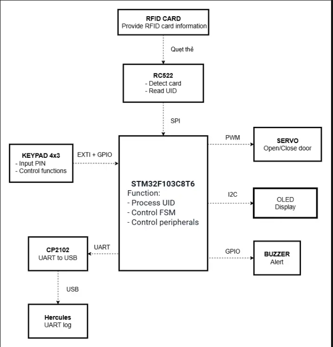
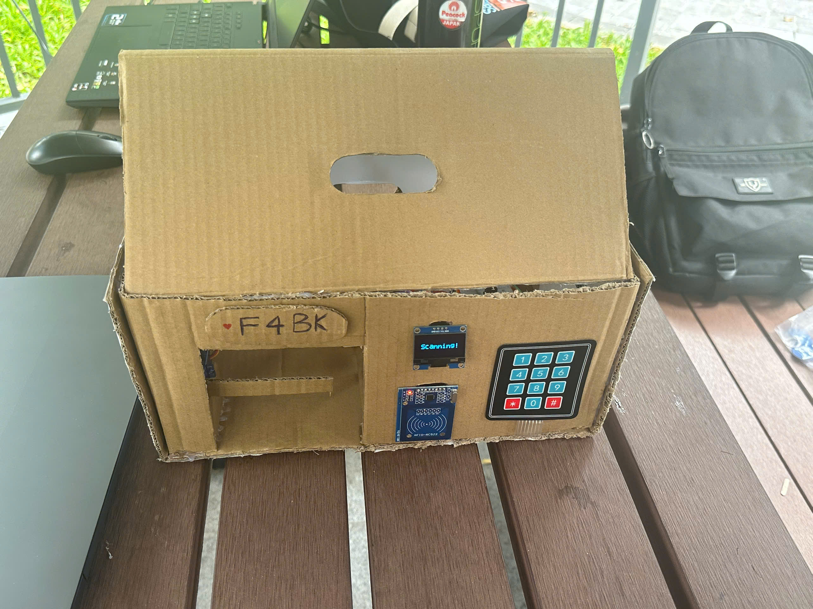
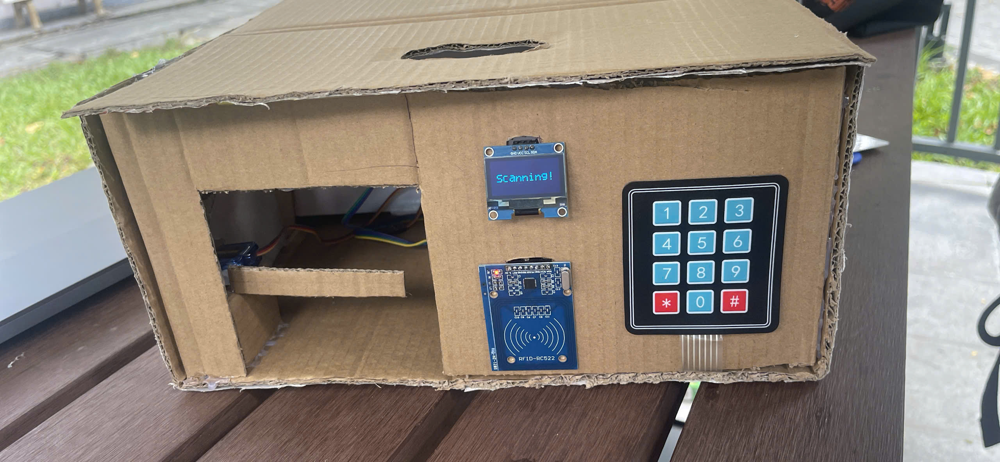

# F4BK — RFID & Keypad Door Lock System on STM32F103C8T6

## Table of Contents
- [1. Overview](#1-overview)
- [2. System Architecture](#2-system-architecture)
- [3. Repository Structure](#3-repository-structure)
- [4. Main Logic / FSM & Response Levels](#4-main-logic--fsm--response-levels)
- [5. System Requirements](#5-system-requirements)
  - [5.1 Hardware](#51-hardware)
  - [5.2 Software](#52-software)
- [6. Communication Protocols (Summary)](#6-communication-protocols-summary)
- [7. Getting Started](#7-getting-started)
- [8. Demo Output](#8-demo-output)
- [9. Related Documents & Repositories](#9-related-documents--repositories)
- [10. Known Gaps](#10-known-gaps)
- [11. Team & License](#11-team--license)

## 1. Overview

**F4BK** is a smart door lock system using RFID cards and passwords, built on the **STM32F103C8T6 (Blue Pill)** microcontroller for a capstone project — team **F4BK (Group 7)**.

The system authenticates users through **two methods**: tapping an RFID card (via the RC522 module) or entering a password on a matrix keypad. When authentication succeeds, an SG90 servo unlocks the door, then automatically re-locks it after a set period of time. Every access attempt is displayed on an OLED screen and logged via UART to a computer for monitoring. The Admin can add/remove cards or add/remove Admin privileges on the spot using the keypad.

> ⚠️ **F4BK is an academic demo model.** The SG90 servo only simulates a door-locking mechanism (it is not an actual high-power electric lock). The system has no cloud/server connection, does not sync data over a network, and does not use biometric recognition.

**Timeline:** Sprint 1 (Jul 21–30) → Sprint 2 (Aug 1–15) → Sprint 3 (Aug 16–23).

## 2. System Architecture


## 3. Repository Structure

| Thành phần      | Nội dung                                                    |
|-----------------|--------------------------------------------------------------|
| `Core/`         | Mã nguồn và cấu hình chính của project STM32                |
| `Core/Inc/`     | Các file header `.h`                                         |
| `Core/Src/`     | Các file source `.c`                                          |
| `Drivers/`      | Driver/thư viện giao tiếp với các ngoại vi                   |
| `App/`          | Logic nghiệp vụ của hệ thống kiểm soát cửa                    |
| `App/RFID/`     | Xử lý RC522, đọc và xác thực UID                              |
| `App/Keypad/`   | Xử lý keypad và nhập PIN                                      |
| `App/Servo/`    | Điều khiển servo bằng PWM                                     |

## 4. Main Logic / FSM & Response Levels

Full state diagram: [`F4BK_FSM.PNG`](https://drive.google.com/file/d/14dICIdWbOcxtWcCkS_937QGVBvgwX4nr/view?usp=sharing)

**Three main authentication sources feeding into the FSM:**

| Source | Trigger Condition |
|---|---|
| **RFID (RC522)** | Tap a card within reading range (~2–5 cm) → UID matched against the authorized list |
| **Keypad** | Enter a password sequence, press confirm key → matched against the stored password *(extended version)* |
| **Admin trigger** | Tap the Admin card → enters `ADMIN_MODE`, then select Add Card / Delete Card / Change Admin on the Keypad |

**System response levels (state → hardware response):**

| State | Response |
|---|---|
| **IDLE** | Waiting for a card tap or key input; OLED shows the idle screen |
| **CHECKING (valid)** | OLED shows "Welcome", servo opens to 90°, UART logs "Accepted", auto-closes after 5 seconds |
| **CHECKING (invalid)** | OLED shows "Denied", buzzer sounds an alert for 2 seconds, servo does not open, UART logs "Denied" |
| **ADMIN_MODE** | Waits for Add/Delete/Change-Admin action within a timeout (5 seconds); exits automatically if no action is taken |
| **LOCKED** *(extended version)* | Triggered when an unknown card is repeatedly tapped ("spammed") past a threshold level — OLED shows "Secured", buzzer alerts, UART logs "System locked" |
| **ERROR** *(extended version)* | Triggered when a signal wire loses connection — OLED shows "Error", buzzer sounds continuously until stable |

**Acceptance criteria (Demo) — summarized in 5 groups:**
1. Core operation (door opens/closes on the correct schedule, buzzer duration is correct)
2. Standard card management (add/remove cards, add/remove Admin)
3. Hardware & power safety (unplugging cables, power loss → system resets and retains data)
4. User data security (UID encrypted before being stored in Flash)
5. Exception handling (timeout, duplicates, incorrect deletion, card spamming, Admin protection)

## 5. System Requirements

### 5.1 Hardware

| Component | Specification | Quantity |
|---|---|---|
| STM32F103C8T6 Blue Pill | Main microcontroller | 1 |
| RC522 | RFID read/write module, SPI interface | 1 |
| MIFARE RFID card | 13.56 MHz, FM1108 8KB | 3–7 |
| SG90 Servo | Simulates the locking mechanism, PWM controlled | 1 |
| OLED SH1106 | Status display, I2C interface | 1 |
| Buzzer | Alerts, GPIO controlled | 1–2 |
| Keypad | Password entry, Admin management *(extended version)* | 1 |
| Through-hole push button | Add/remove cards *(old version only)* | 2–4 |
| CP2102 (USB–UART) | UART communication with PC | 1 |
| ST-Link V2 | Programming/flashing | 1 |
| NPN 2N2222 Transistor | Buffer circuit to protect current for the Buzzer | 1 |
| 1kΩ Resistor | Circuit support | 1–10 |
| Capacitors (ceramic/electrolytic) | Power filtering | a few |
| Breadboard, jumper wires, male/female headers | Assembly, testing | many |
| Model frame | Cardboard/acrylic | 1 |

*(Full list and procurement progress available at [`Docs/CHECKLIST_LINH_KIEN.xlsx`](https://docs.google.com/spreadsheets/d/1_C4QgRqpFv_rJgNZYetVfxqti68Y2CCwMFI3uRh6qD4/edit?usp=sharing).)*

### 5.2 Software

- **STM32CubeMX** — microcontroller configuration, environment file generation
- **VS Code** — source code writing, build via CMake + Ninja
- **STM32CubeProgrammer** — flashing the program onto the microcontroller
- **Hercules** — monitoring data sent over UART
- **Git & GitHub** — source code version control, team collaboration
- **draw.io** — drawing block diagrams and FSM
- **KiCad** — PCB circuit design
- **Library:** STM32 HAL Library

## 6. Communication Protocols (Summary)

**UART → PC** (via CP2102, viewed on Hercules): each time a card is tapped/a password is entered, the system sends a log line containing the UID (if applicable) and access status (`Accepted` / `Denied` / `Card Exists` / `Not Found` / `System locked` / `Error`).

**SPI ↔ RC522:** reads the RFID card UID within a range of ~2–5 cm.

**I2C ↔ OLED:** displays status according to each FSM state (I2C address and speed configured in `OLED.h`).
> For detailed UART data frame format and specific pin mapping, see [`Docs/F4BK_SƠ ĐỒ CHÂN STM32.jpg`](https://drive.google.com/file/d/19UpyDO7NRIW5suYX4cPgtHUJO4FrxmLx/view?usp=sharing).

## 7. Getting Started

**To run the entire system (full version):**
1. Clone the repository:
```bash
   git clone <link-repo-F4BK>
```
2. Open the project folder in your code editor (VS Code or equivalent IDE).
3. Wire up the hardware according to the schematic (RC522 – SPI, OLED – I2C, Servo – PWM, Buzzer – GPIO, Keypad – GPIO/EXTI), referring to [`Docs/F4BK_SƠ ĐỒ CHÂN STM32.jpg`](https://drive.google.com/file/d/19UpyDO7NRIW5suYX4cPgtHUJO4FrxmLx/view?usp=drive_link) for correct pin connections.
4. Plug the ST-Link V2 into the STM32F103C8T6 board and connect it to the computer.
5. Build and flash the program using the provided script:
```bash
   .\build_and_flash
```
6. Open **Hercules** on the PC (via CP2102) to monitor the UART log.
7. Tap an RFID card or enter a password on the Keypad to test the authentication flow.

**To test individual modules (without assembling the whole system):**
- Build and flash each test module (RC522 / OLED / Servo / Buzzer / Keypad) separately using the same `.\build_and_flash` script, following the Test Cases in TC1 of the project outline — check the log on Hercules to confirm each peripheral works independently before integration.

## 8. Demo Output

Demo video of the working system: `Demo.mp4` [link in the project outline/Repo](https://youtube.com/watch?v=keH3I--v1AQ&si=Gdj_lMe266tv9noc)

**Photos of the assembled physical model:**

| View 1 | View 2 |
| :---: | :---: |
|  |  |

## 9. Related Documents & Repositories

- **Project Outline & SRS**: see the main project outline document, SRS section — link in the team's Drive.
- **Schematic & PCB**: https://drive.google.com/drive/folders/1QpPNTRdVFFpzzwcUPB6fQnJaHhNNU38v
- **General working rules** (Git workflow, naming conventions, source code organization): Repo link — authored by Quang Tin.
- **Component checklist & expense tracking**: [`Docs/CHECKLIST_LINH_KIEN.xlsx`](https://docs.google.com/spreadsheets/d/1_C4QgRqpFv_rJgNZYetVfxqti68Y2CCwMFI3uRh6qD4/edit?usp=sharing)
- **Reference datasheets:**
  - [1] [STM32F103xx Reference Manual: STMicroelectronics, "RM0008 Reference manual - STM32F101xx, STM32F102xx, STM32F103xx, STM32F105xx and STM32F107xx advanced ARM®-based 32-bit MCUs"](https://www.st.com/resource/en/reference_manual/rm0008-stm32f101xx-stm32f102xx-stm32f103xx-stm32f105xx-and-stm32f107xx-advanced-armbased-32bit-mcus-stmicroelectronics.pdf)
  - [2] [RC522 RFID Reader Module: NXP Semiconductors, "MFRC522 - Standard performance MIFARE and NTAG frontend Datasheet", Rev 3.9, 2016](https://www.nxp.com/docs/en/data-sheet/MFRC522.pdf)
  - [3] [SG90 Servo Motor: SG90 Micro Servo, "SG90 9 g Micro Servo"](https://www.friendlywire.com/projects/ne555-servo-safe/SG90-datasheet.pdf)
  - [4] [1.3inch-SH1106-OLED](https://drive.google.com/file/d/1k7gNZdSjfuEepwddNTzzZC5yC7yZWS4H/view?usp=drive_link)

- **GitHub/Tutorial references:**
  - [1] [STM32-RFID-Access-Control](https://github.com/CerenSultanCETIN/STM32-RFID-Access-Control.git)
  - [2] [Interfacing MFRC522 RFID Module with STM32 using SPI Communication](https://controllerstech.com/stm32-mfrc522-rfid-interface-using-spi/)
  - [3] [Interface SH1106 1.3″ OLED Display with STM32 Using I2C](https://controllerstech.com/interface-sh1106-oled-display-with-stm32/)
  - [4] [SH1106 driver 1.3 OLED display for STM32 using HAL](https://github.com/desertkun/SH1106.git)
  - [5] [Programming STM32 with the UART Protocol](https://khuenguyencreator.com/lap-trinh-stm32-voi-giao-thuc-uart/)

## 10. Known Gaps
- **No cloud/server connection or remote management app** — this is an intentional scope limitation, not an oversight.
- **No real electromagnetic lock used** — the SG90 servo only simulates the locking mechanism and does not represent real-world locking force.
## 11. Team

**Team F4BK (Group 7):**
- Le Quang Tin – 2413505 (Team Leader)
- Ngo Hoang Tam – 2413062
- Nguyen Pham Tan Nghiem – 2510343
- Le Huynh Duc Thinh – 2510379

**Referenced libraries (credit required):**
- `SH1106.c/.h` — referenced from [desertkun/SH1106](https://github.com/desertkun/SH1106.git)
- `RC522.c/.h` — referenced from [STM32-RFID-Access-Control](https://github.com/CerenSultanCETIN/STM32-RFID-Access-Control.git)